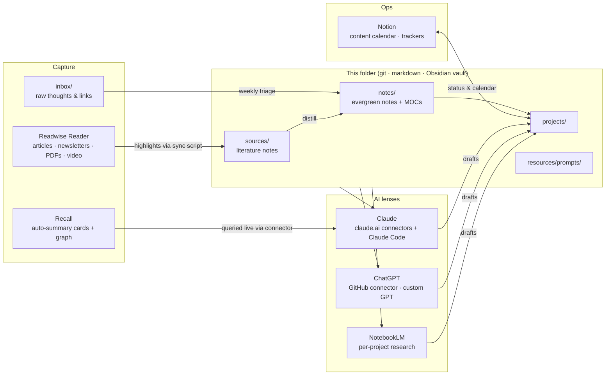

# Second Brain

One canonical, plain-text, git-versioned knowledge base that every AI can read —
fed by the apps where capture actually happens.

The problem this solves: Readwise Reader, Recall, and Notion each hold fragments,
so no tool ever has the whole picture and nothing compounds. The fix is not
another app. It is a **hub**: markdown files in this folder are the system of
record for distilled knowledge; every other tool is either a capture funnel into
it or a lens over it.

**The one rule:** capture anywhere, but knowledge lives here. If an idea matters,
it eventually becomes a note in `notes/` — in your own words, linked, reusable.

## System map



## Tool roles — who is the system of record for what

| Tool | Role | System of record for |
|---|---|---|
| **Readwise Reader** | Universal capture funnel: articles, newsletters, PDFs, YouTube. Read + highlight here. | Reading queue, raw highlights |
| **Recall** | Auto-summarized cards, knowledge graph, spaced review. Secondary capture for "summarize this now" moments. | Nothing (a lens — queried live via Claude connector) |
| **Notion** | Operations: content calendar, client trackers, databases. **Not** the knowledge store. | Operational status, structured databases |
| **This folder** | The hub. Distilled knowledge, prompts, project thinking. | Evergreen notes, literature notes, prompt library |
| **Obsidian** | Editor over this folder (open `second-brain/` as a vault). Backlinks, graph, fast capture. | Nothing (an editor) |
| **NotebookLM** | Per-project research workbench: load 10–50 sources, interrogate with citations, audio overviews. | Nothing (ephemeral; conclusions come back as notes) |
| **Claude** | Primary AI. claude.ai with Readwise/Recall/Notion connectors for retrieval; Claude Code on this repo as librarian and writing partner. | — |
| **ChatGPT** | Second AI. GitHub connector to this repo; deep research; second opinions. | — |

## The loop

**Capture → Triage → Distill → Express** (Tiago Forte's CODE, wired to real tools):

1. **Capture** (daily, ~0 effort): save to Reader with one topic tag and a
   one-line "why I saved this" note. Stray ideas → `inbox/` or a quick Obsidian note.
2. **Triage** (weekly, 30 min): empty Reader inbox (archive/later/delete), run
   the Readwise sync, process `inbox/` to zero. Checklist: [docs/workflows.md](docs/workflows.md).
3. **Distill** (same session): promote 1–3 highlights-worth-keeping into
   evergreen notes in `notes/` — your own words, claim-shaped titles, linked into a MOC.
4. **Express** (whenever): LinkedIn posts, the Small Firm Brief, playbook kits,
   client work — drafted by Claude *from your notes*, not from a blank page.
   Prompts: [resources/prompts/](resources/prompts/).

## Folder map

```
second-brain/
├── README.md            ← you are here
├── CLAUDE.md            ← operating manual for AI agents working this vault
├── docs/
│   ├── system.md        ← architecture: principles, data flow, sync directions
│   ├── capture.md       ← what goes where + tag vocabulary
│   ├── workflows.md     ← daily / weekly / monthly routines (checklists)
│   └── ai-playbook.md   ← Claude, ChatGPT, NotebookLM setup + usage recipes
├── inbox/               ← raw captures; emptied weekly
├── sources/             ← literature notes (one per book/article/video)
│   └── readwise/        ← machine-synced highlights (gitignored — repo is public)
├── notes/               ← evergreen notes: the actual asset
│   └── mocs/            ← maps of content, one per area
├── projects/            ← active initiatives (one folder each)
├── resources/
│   └── prompts/         ← reusable prompt library for Claude / ChatGPT / NotebookLM
├── archive/             ← done/dormant material (never delete, archive)
├── templates/           ← note templates
└── scripts/
    └── readwise_sync.py ← Readwise → sources/readwise/ (stdlib only)
```

## Quick start (day one, ~20 minutes)

1. **Obsidian**: open `second-brain/` as a vault (Open folder as vault). The
   `.obsidian/` config folder is gitignored — settings stay per-machine.
2. **Readwise sync**: get a token at <https://readwise.io/access_token>, then:
   ```sh
   export READWISE_TOKEN=xxx
   python3 second-brain/scripts/readwise_sync.py --limit 20   # trial run
   python3 second-brain/scripts/readwise_sync.py --full        # full backfill
   ```
   Details and privacy notes: [scripts/README.md](scripts/README.md).
3. **Claude**: connectors for Readwise, Recall, and Notion are already wired to
   claude.ai. For vault work, open a Claude Code session on this repo and say
   *"Run the weekly review"* — it follows [resources/prompts/weekly-review.md](resources/prompts/weekly-review.md).
4. **ChatGPT**: connect GitHub → select `gyates45/curated` so ChatGPT can read
   the vault too. Recipe: [docs/ai-playbook.md](docs/ai-playbook.md).
5. Do your first **weekly review** ([docs/workflows.md](docs/workflows.md)) and
   write one evergreen note. The system is live.

## ⚠️ This repo is public

Raw highlight dumps (copyrighted text) and anything client-identifiable stay
out of git: `sources/readwise/` and every `private/` folder are gitignored.
What *is* committed — evergreen notes in your own words, MOCs, prompts, docs —
is written to be publishable. Full policy: [docs/system.md](docs/system.md#public-repo-policy).
